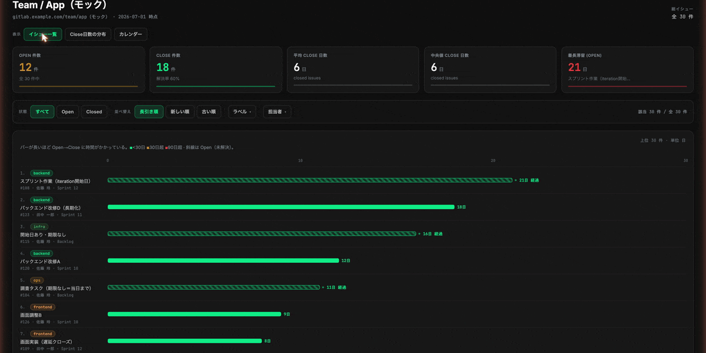
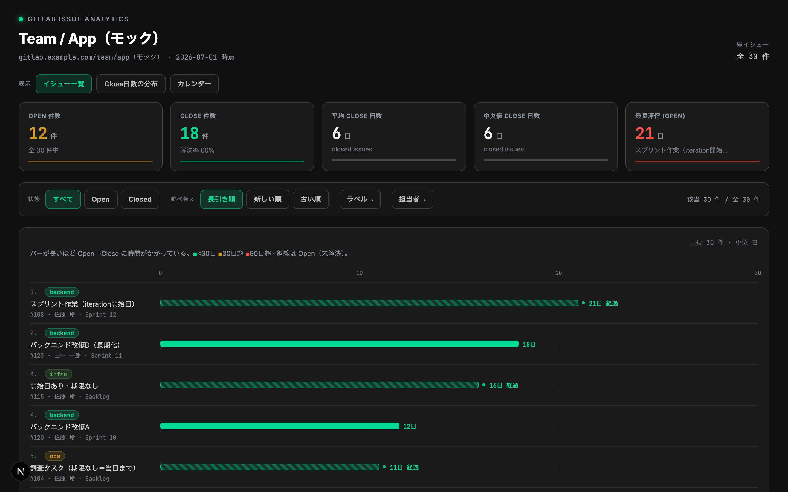
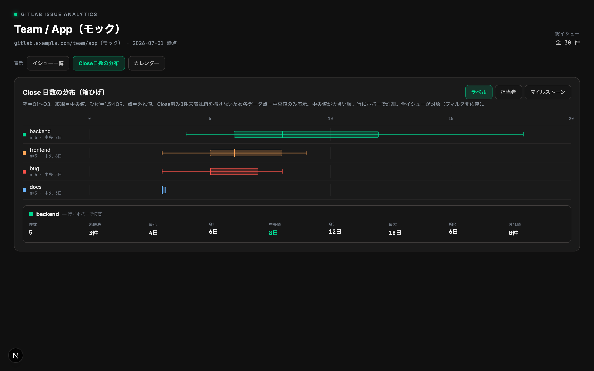
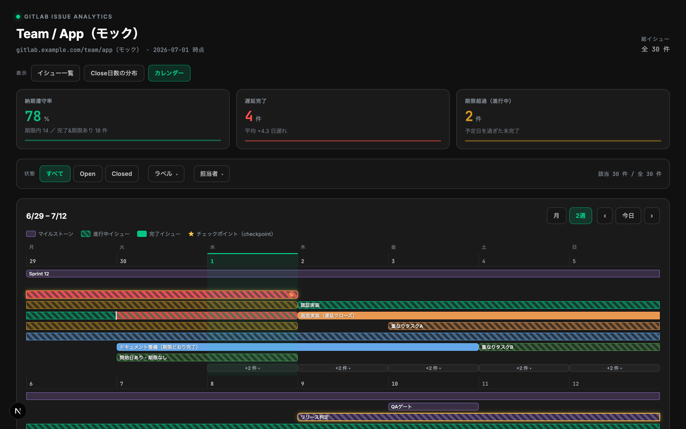
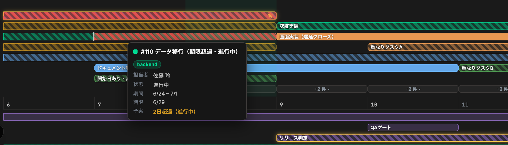

# GitLab イシュー分析ダッシュボード

> **「遅れてる？ オンスケ？」を、GitLab の Issue から一枚で。** 管理職にそのまま見せられる、見るだけのダッシュボード。

小さなチームで GitLab を使っている。進捗を聞かれるたびに Issue を開いて回り、「あれは遅れ気味、これはオンスケ…」と頭の中で組み立て直す。かといって有料プランや Jira を入れるほどでもない（社内承認もだるい）。Excel で予定表を作るのは、もっとやりたくない。

欲しいのは、管理より俯瞰。今どうなっているかをぱっと見で把握して、そのまま管理職に見せられる。それだけでいい。

だからこのダッシュボードは、GitLab の Issue を取り込んで見せることに徹した。編集は今までどおり GitLab で。遅れとオンスケが色とバーで分かる図を、**追加課金なし**で。

**こんな人に:**

- GitLab は使ってるけど、有料プランや Jira を入れるほどじゃない小さなチーム
- 「進捗どう？」に、ぱっと見で答えたい／管理職に見せたい
- 管理というより、自分たちの進み具合を俯瞰して振り返りたい
- Excel の予定表づくりや手集計から解放されたい
- 編集は GitLab でいい、見るだけでいい
- とにかくめんどくさいのは避けたい



> 凡例の ★をクリックしてみましょう。大事な仕事は光って教えてくれます。

## 3つのビュー

### 1. イシュー一覧：どれが長引いてる？



> この仕事長引いてるな〜。取り組む課題は一目で区別したいですよね。

### 2. Close日数の分布：何が、誰が時間かかってる？



> 統計データで今月の仕事を振り返りましょう。

### 3. カレンダー：遅れてる？ オンスケ？



> 遅れている予定は赤いハッチで一目瞭然です。



## クイックスタート

**まず動かす（GitLab 不要）**：サンプルデータで全機能を表示。

```sh
npm install
MOCK_GITLAB=1 npm run dev     # → http://localhost:48273
```

**実データにつなぐ**：`.env.example` を写して GitLab の値を入れるだけ。

```sh
cp .env.example .env.local
# GITLAB_BASE_URL / GITLAB_PROJECT_ID / GITLAB_TOKEN（read_api スコープ）を編集
npm run dev                   # → http://localhost:48273
```

トークンは **サーバ側（Route Handler）でのみ** 使い、ブラウザには出しません。

GitLab 応答は 60 秒キャッシュ。Docker での起動は下記「詳細」を参照。

## 詳細

<details>
<summary><b>アーキテクチャ</b></summary>

```
Browser ─▶ Next.js(:48273)
   app/page.tsx ─renders─▶ components/Dashboard.tsx ('use client')
   app/api/issues/route.ts (サーバ専用) ─▶ GitLab REST API v4 (PRIVATE-TOKEN)
   Dashboard ─fetch('/api/issues')─▶ フィルタ/並べ替え/箱ひげ/カレンダーはクライアントで即時集計
```

- **GitLab トークンはサーバ側（Route Handler）でのみ使用**し、ブラウザへ露出しない。
- バックエンドは生 Issue＋マイルストーンを1回配信、集計はクライアント（クリックごとの往復なし）。
- GitLab 応答は 60 秒キャッシュ（Next の `revalidate`）。
- 技術スタック: Next.js 16（App Router）/ React 19 / TypeScript。チャートライブラリは不使用（自前の CSS 描画）。

</details>

<details>
<summary><b>環境変数（全一覧）</b></summary>

| 変数 | 必須 | 例 / 既定 | 説明 |
|---|---|---|---|
| `GITLAB_BASE_URL` | ✔ | `https://gitlab.com` | GitLab の URL（セルフホスト可） |
| `GITLAB_PROJECT_ID` | ✔ | `group/project` or `278964` | プロジェクト（パス or 数値 ID） |
| `GITLAB_TOKEN` | ✔ | `glpat-…` | Personal Access Token（`read_api` スコープ） |
| `GITLAB_MAX_ISSUES` | | `2000` | 取得上限（ページング保護） |
| `CHECKPOINT_LABEL` | | `checkpoint` | カレンダーで ★ チェックポイント扱いにするラベル名 |
| `PORT` | | `48273` | 待受ポート（非慣例ポート） |
| `MOCK_GITLAB` | | （未設定） | `1` で `lib/devMock.ts` のサンプルを配信（`GITLAB_*` 不要） |

`.env.example` をコピーして使う（`cp .env.example .env.local`）。`.env.local` は開発（`npm run dev`）が読む。

</details>

<details>
<summary><b>Docker で動かす</b></summary>

`scripts/docker.sh` がビルド／起動のラッパー（推奨）:

```sh
cp .env.example .env        # GITLAB_* を実値に編集（run に必須）
./scripts/docker.sh up      # build → run → http://localhost:48273
```

| サブコマンド | 説明 |
|---|---|
| `build` | イメージ `gitlab-issue-dashboard` をビルド |
| `run` | ビルド済みを起動（`-d`、`restart=unless-stopped`）。既存 `gitlab-dashboard` は自動で `rm -f` して置換 |
| `up` | `build` → `run`（既定） |
| `stop` | コンテナ停止・削除 |
| `logs` | ログ追尾 |

- イメージ名 `gitlab-issue-dashboard` / コンテナ名 `gitlab-dashboard` / ポート `48273`（`PORT` で変更可）。
- ビルドは**従来ビルダー既定**（`DOCKER_BUILDKIT=0`）。BuildKit はキャッシュ済みベースイメージでも
  docker.io へタグ解決に行くため、レジストリ未到達環境（例: colima で docker.io を名前解決できない）だと
  `FROM node:22-alpine … no such host` で失敗する。BuildKit を使うなら
  `DOCKER_BUILDKIT=1 ./scripts/docker.sh build`。
- 多段ビルドで最終イメージは Next standalone サーバ + 静的資産のみ（非 root `node` 実行）。
- フォント（Inter / JetBrains Mono）はビルド時に自己ホスト化（実行時 CDN 依存なし）。
- トークンはイメージに焼き込まず、実行時に env で注入。
- `/api/healthz` がヘルスチェック用（GitLab を呼ばない）。

`docker compose` でも可（同じく `.env` に GITLAB_* を置く）:

```sh
cp .env.example .env
docker compose up --build
```

</details>

<details>
<summary><b>機能の詳細</b></summary>

- **サマリー指標**：Open / Close 件数、平均・中央値 Close 日数、最長滞留（Open）
- **フィルタ**：状態（すべて / Open / Closed）、ラベル・担当者の検索付き複数選択（クリア可）。
  ランキングとカレンダーに連動（分布は全イシュー対象でフィルタ非依存）
- **並べ替え**：長引き順 / 新しい順 / 古い順
- **滞留ランキング**：Open→Close の滞留日数をガント風バーで可視化（緑 <30日 / 黄 30日超 / 赤 90日超、斜線＝未解決）
- **Close 日数の分布**：ラベル / 担当者 / マイルストーン別の箱ひげ図（箱＝Q1〜Q3、縦線＝中央値、
  ひげ＝1.5×IQR、点＝外れ値）。Close 1〜2 件のグループは各点＋中央値で表示。行ホバーで統計詳細
- **カレンダー**：マイルストーン／イシューを月・2週タイムラインで表示
  （開始＝`start_date`｜`created_at`、終了＝`closed_at`｜`due_date`｜今日）
  - 週あたりの表示レーンに上限（月＝3 / 2週＝6）を設け、超過分は日別 **「+N 件」チップ**に集約。
    クリックでその日の全予定をポップアップ表示
  - バーにホバーで詳細ツールチップ（#ID・ラベル・担当者・状態・期間・期限・予実差分）
  - **納期予実**：予定＝`due_date`／実績＝`closed_at`。予定日を過ぎたイシューはバーが実線（予定内）＋
    **赤ハッチ（超過分）**に割れ、予定日に予定線（▼ティック）を表示。完了遅延は `[予定日..完了日]`、
    進行中で期限超過は終端を今日まで延ばして `[予定日..今日]` をハッチ（予定日が無く未完了は対象外）。
    上部に **予実サマリー**（納期遵守率＝期限内完了／完了&期限あり・遅延件数＋平均超過・期限超過件数）
  - **チェックポイント**（`CHECKPOINT_LABEL`）は常に表示（あふれ対象外）＋金枠リングで強調、期限に ★。
    凡例のチェックポイントをクリックすると ★ と金枠が光り、他要素が一時的に減光する演出

</details>

<details>
<summary><b>開発・テスト</b></summary>

```sh
npm test           # 変換・集計・カレンダーロジックの単体テスト (vitest)
npm run typecheck  # 型チェック
npm run build      # 本番ビルド（.next/standalone を生成）
```

`MOCK_GITLAB=1` のときは `lib/devMock.ts` のサンプル（3ビューを一通り描けるよう滞留・分布・納期予実を含む）で描画する。GitLab 認証は不要。

</details>

<details>
<summary><b>ファイル構成</b></summary>

```
app/
  layout.tsx           # フォント（next/font）・メタ
  page.tsx             # <Dashboard/>
  api/issues/route.ts  # GitLab 取得 → JSON（サーバ専用。MOCK_GITLAB でモック）
  api/healthz/route.ts # ヘルスチェック
  globals.css  icon.svg
components/
  Dashboard.tsx        # 'use client'、3 ビューの描画 + 状態
  CalendarView.tsx     # カレンダー描画（ツールチップ / あふれポップ / 演出）
  FilterControls.tsx   # 状態・ラベル・担当者のフィルタバー（一覧/カレンダー共有）
  FilterDropdown.tsx   # 検索付き複数選択ドロップダウン
lib/
  gitlab.ts            # GitLab 取得（ページング）+ Issue / Milestone 変換
  logic.ts             # 集計・箱ひげ・カレンダー view-model（renderVals / buildCalendar）
  devMock.ts           # 開発用モックデータ（MOCK_GITLAB 時）
  types.ts
  *.test.ts            # vitest（変換・集計・カレンダー）
scripts/docker.sh      # Docker build / up / run / stop / logs ラッパー
docs/                  # README 用スクリーンショット・GIF
Dockerfile  docker-compose.yml  .dockerignore
design/                # インポート元のデザインソース（参照用）
```

</details>

<details>
<summary><b>設計上の割り切り</b></summary>

- GitLab の Issue は複数ラベルを持てる。**表示**（ランキングのラベルチップ・分布のラベル別集計）は
  元デザインに合わせ **先頭ラベル（GitLab が返す配列の先頭）を代表ラベル**として 1 件に集約する。
  一方 **ラベル絞り込みとフィルタのドロップダウンは全ラベルを対象**とする
  （複数ラベルのいずれかが一致すれば該当し、どのラベルも選択肢に並ぶ）。
  カレンダーの ★ チェックポイント判定も全ラベルを見る。
  ラベル無しは「未分類」。担当者無しは「未割当」、マイルストーン無しは「Backlog」。
- 滞留日数 `linger` は、Open は「作成からの経過日数」、Closed は「作成→クローズの所要日数」。

</details>

## ライセンス

[MIT License](LICENSE) © 2026 Motohiro Horiuchi
